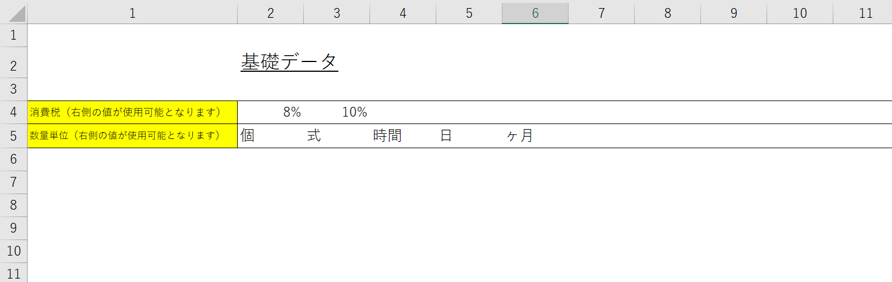

# T0001_見積書作成ツール

<!-- START doctoc generated TOC please keep comment here to allow auto update -->
<!-- DON'T EDIT THIS SECTION, INSTEAD RE-RUN doctoc TO UPDATE -->
目次

- [T0001_見積書作成ツール](#t0001_%E8%A6%8B%E7%A9%8D%E6%9B%B8%E4%BD%9C%E6%88%90%E3%83%84%E3%83%BC%E3%83%AB)
  - [概要](#%E6%A6%82%E8%A6%81)
  - [動作環境](#%E5%8B%95%E4%BD%9C%E7%92%B0%E5%A2%83)
  - [機能一覧](#%E6%A9%9F%E8%83%BD%E4%B8%80%E8%A6%A7)
  - [ツールとしての長所](#%E3%83%84%E3%83%BC%E3%83%AB%E3%81%A8%E3%81%97%E3%81%A6%E3%81%AE%E9%95%B7%E6%89%80)
  - [使用方法](#%E4%BD%BF%E7%94%A8%E6%96%B9%E6%B3%95)
    - [1.データ入力](#1%E3%83%87%E3%83%BC%E3%82%BF%E5%85%A5%E5%8A%9B)
      - [基礎データの入力](#%E5%9F%BA%E7%A4%8E%E3%83%87%E3%83%BC%E3%82%BF%E3%81%AE%E5%85%A5%E5%8A%9B)
      - [商品データの登録](#%E5%95%86%E5%93%81%E3%83%87%E3%83%BC%E3%82%BF%E3%81%AE%E7%99%BB%E9%8C%B2)
      - [見積商品セットデータの登録](#%E8%A6%8B%E7%A9%8D%E5%95%86%E5%93%81%E3%82%BB%E3%83%83%E3%83%88%E3%83%87%E3%83%BC%E3%82%BF%E3%81%AE%E7%99%BB%E9%8C%B2)
      - [見積データの登録](#%E8%A6%8B%E7%A9%8D%E3%83%87%E3%83%BC%E3%82%BF%E3%81%AE%E7%99%BB%E9%8C%B2)
    - [2.出力の設定値を設定](#2%E5%87%BA%E5%8A%9B%E3%81%AE%E8%A8%AD%E5%AE%9A%E5%80%A4%E3%82%92%E8%A8%AD%E5%AE%9A)
    - [3.見積書作成実行](#3%E8%A6%8B%E7%A9%8D%E6%9B%B8%E4%BD%9C%E6%88%90%E5%AE%9F%E8%A1%8C)
      - [作成対象のデータ番号を指定](#%E4%BD%9C%E6%88%90%E5%AF%BE%E8%B1%A1%E3%81%AE%E3%83%87%E3%83%BC%E3%82%BF%E7%95%AA%E5%8F%B7%E3%82%92%E6%8C%87%E5%AE%9A)
      - [見積書作成](#%E8%A6%8B%E7%A9%8D%E6%9B%B8%E4%BD%9C%E6%88%90)
      - [PDF作成](#pdf%E4%BD%9C%E6%88%90)
  - [ご要望について](#%E3%81%94%E8%A6%81%E6%9C%9B%E3%81%AB%E3%81%A4%E3%81%84%E3%81%A6)

<!-- END doctoc generated TOC please keep comment here to allow auto update -->

<!--
-->
<!--  <ul>-->
<!--    <li><a href="#T0001_見積書作成ツール">T0001_見積書作成ツール</a>-->
<!--      <ul>-->
<!--        <li><a href="#概要">概要</a></li>-->
<!--        <li><a href="#動作環境">動作環境</a></li>-->
<!--        <li><a href="#機能一覧">機能一覧</a></li>-->
<!--        <li><a href="#ツールとしての長所">ツールとしての長所</a></li>-->
<!--        <li><a href="#使用方法">使用方法</a>-->
<!--          <ul>-->
<!--            <li><a href="#1.データ入力">1.データ入力</a>-->
<!--              <ul>-->
<!--                <li><a href="#基礎データの入力">基礎データの入力</a></li>-->
<!--                <li><a href="#商品データの登録">商品データの登録</a></li>-->
<!--                <li><a href="#見積商品セットデータの登録">見積商品セットデータの登録</a></li>-->
<!--                <li><a href="#見積データの登録">見積データの登録</a></li>-->
<!--              </ul>-->
<!--            </li>-->
<!--            <li><a href="#2.出力の設定値を設定">2.出力の設定値を設定</a></li>-->
<!--            <li><a href="#3.見積書作 成実行">3.見積書作 成実行</a>-->
<!--              <ul>-->
<!--                <li><a href="#作成対象のデータ番号を指定">作成対象のデータ番号を指定</a></li>-->
<!--                <li><a href="#見積書作成">見積書作成</a></li>-->
<!--                <li><a href="#PDF作成">PDF作成</a></li>-->
<!--              </ul>-->
<!--            </li>-->
<!--          </ul>-->
<!--        </li>-->
<!--        <li><a href="#ご要望について">ご要望について</a></li>-->
<!--      </ul>-->
<!--    </li>-->
<!--  </ul>-->
<!--
-->

## 概要

　一枚～複数枚の見積書を作成する。

　テンプレート見積書に設定したデータを挿入し、見積書格納先の別ブックを作成。

## 動作環境

　2013以上のOfficeソフトが動作する環境であれば可。

　2010以下のOfficeでも動作する可能性はあります

（そこまでの下位Ver.互換性に需要があるかどうかは不明なため、検証はしていません）。

## 機能一覧

1. 見積書作成機能
2. PDF版見積書作成機能
3. 取引先団体データ、商品データ管理機能
4. データ入力補助、ミス低減機能

## ツールとしての長所

- ヒューマンエラーの低減が図れます。
- 速度面での業務効率化が図れます。
- 現段階では「見積書」を対象にしていますが、指定項目とテンプレートを変更することでどのような文書にも対応できる柔軟性があります（例：発注書、請求書、申込書、社内回覧文書）。
- ユーザ側で、ある程度データの追加が可能です。

## 使用方法

### 1.データ入力

　テンプレート見積書に挿入するデータを入力します。

#### 基礎データの入力

　各見積書で共通の値を入力します。

　現在は

 - 消費税
 - 商品の数量単位

が設定可能です。

#### 商品データの登録

　文書で用いる商品を登録します。

　商品コードを入力するとNo.は自動採番されます。

　商品コード列に重複する値を入力すると、警告メッセージが表示され、値が削除されます。

#### 見積商品セットデータの登録

　各見積書で用いる商品すべてを含むセットを作成します。

- 見積商品セット番号列に任意の番号を入力します（重複は許容されます）。
- 商品コード列に、商品データシートで入力した値をドロップダウンリストから選択します。
それ以外の値を入力することは制限されている仕様です。
- 数量等のデータを入力します。

　以上の操作を、対象の見積書に記載したい商品個数分繰り返します。

#### 見積データの登録

　見積番号および、各文書固有の設定値（送り先会社名、納期等）を入力します。

　見積商品セット番号列には、見積商品セット番号シートで入力した値をドロップダウンリストから選択します。
それ以外の値を入力することは制限されている仕様です。

　必須項目は見積番号欄～見積商品セット番号欄までです。その他備考欄は必須ではありません。

### 2.出力の設定値を設定

①作成の際に用いる消費税の値を設定します。

②同時に見積書のPDF出力を行うことの有効化を設定します。

### 3.見積書作成実行

#### 作成対象のデータ番号を指定

　見積書作成ボタンを押下すると、

　見積書作成フォームが表示されるため、作成対象のデータ番号を指定します。

　番号は「1　～　見積データ表で記入した最大のデータ番号」の範囲で指定可能です。

　例えば２から４と指定した場合、データ番号2,3,4の見積書のみ作成します。

#### 見積書作成

　フォームの作成ボタンを押下すると、

　新しいブックとして見積書が作成されます（ブック名：見積書_現在時刻）。

　格納フォルダはツールと同じフォルダです。

#### PDF作成

　PDF作成のオプションを有効化していた場合、

　同じフォルダに各見積書のPDF化したファイルを格納したフォルダが作成されます

　（フォルダ名：見積書xlsxファイルと同じ名前）。

## ご要望について

　もし書式の変更や追加の機能の作成等のご要望がございましたら

　こちらを御覧ください。

[My_VBA_Toolsのご説明](https://github.com/dede-20191130/My_VBA_Tools#%E4%BB%95%E4%BA%8B%E3%81%AE%E3%81%94%E4%BE%9D%E9%A0%BC)

