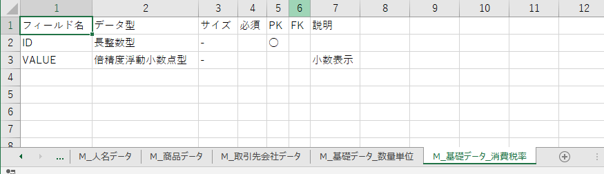

# T0002_Accessテーブル定義エクスポートツール

<!-- START doctoc -->
<!-- END doctoc -->

## 概要

画面で指定したAccessファイル（*.mdb、*.accdb）について、  
すべてのテーブルのテーブル定義を表形式でエクスポートする。  
エクスポート先は新規エクセルブック。テーブルデータがシートごとに格納される。

## 動作環境

Microsoft Officeが動作する環境。  
32bit、64bitいずれも可。

## 機能一覧

1. テーブル定義の表形式でのエクスポート機能

## ツールとしての長所

- テーブル定義の一覧化および目視での把握が容易にできます。
- 手作業で表を作成するよりも効率的です。

## 使用方法

### 1.エクスポートするAccessファイルパスの選択

いずれかの方法で選択します。  
1.エクスポート画面のテキストボックスに直接入力します。  
2.参照ボタンをクリックします。  
ファイル選択ダイアログにおいて出力対象のファイルを選択します。  
テキストボックスにファイルパスが格納されます。

### 2.エクスポート

エクスポートボタンを押下します。  
  
対象のAccessファイルと同階層のフォルダに  
次のようにエクセルファイルが出力されます。  
デザインビュー表示に似せた様式で各情報が一覧できます。

  
  

## コードについて

srcフォルダにソースファイルが格納されています。  

[詳細はこちらに記事化しています。](https://dede-20191130.github.io/learnerBlog/posts/2020/10/25/access-tabledef/)

## ご要望について

　もし書式の変更や追加の機能の作成等のご要望がございましたら

　こちらを御覧ください。

[My_VBA_Toolsのご説明](https://github.com/dede-20191130/My_VBA_Tools#%E4%BB%95%E4%BA%8B%E3%81%AE%E3%81%94%E4%BE%9D%E9%A0%BC)

