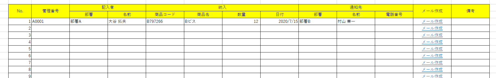
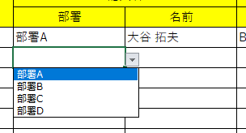
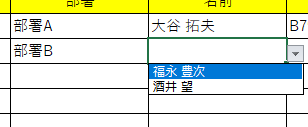
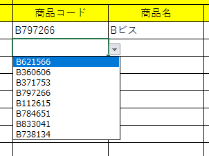
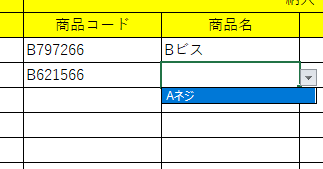
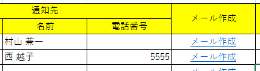
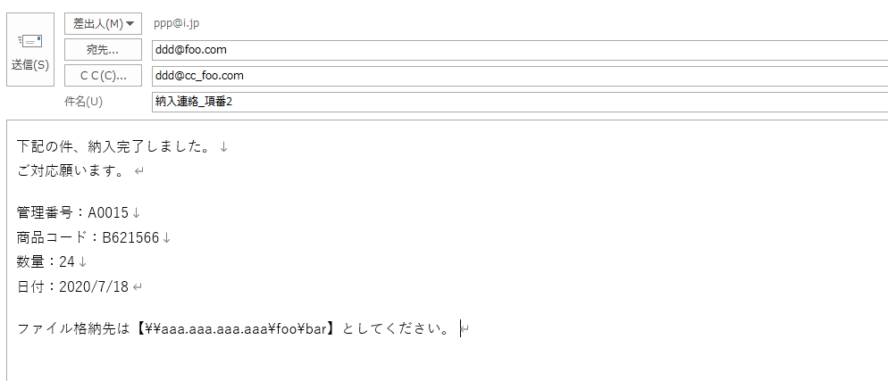

# NOVBA0001_作業記録管理簿_兼_メール作成ツール


```
<!-- START doctoc generated TOC please keep comment here to allow auto update -->
<!-- DON'T EDIT THIS SECTION, INSTEAD RE-RUN doctoc TO UPDATE -->
undefined
<!-- END doctoc generated TOC please keep comment here to allow auto update -->
```


## 概要


テーブルでデータを管理。

管理したデータからメールを作成。


## 動作環境


バージョン2003以上のMSOffice。


## 機能一覧


1. プルダウンによる入力補助機能
2. メール作成機能


## 使用方法


### データ入力

テーブルにデータを入力する。

（特に特定の業務フローを想定して実装していません。

暫定的に納入業務としています。）




#### 入力補助


##### 部署→名前

部署を指定すると、部署マスタシートに記載の人物名のリストをプルダウンとして設定する。


■部署Bを指定すると、




福永～の名前リストが表示される。




##### 商品コード→商品名

商品コードを指定すると、商品マスタシートに記載の商品名を単一項目のプルダウンとして設定する。


■商品コードを指定すると、



単一の商品名が選択できるようになる。




### メール作成

メール作成列のメール作成ハイパーリンクボタンをクリックする。




OSの既定のメールアプリでメールアイテムが立ち上がる。

通知先の部署に対応する部署マスタから宛先、CCが反映されている。

テーブルのデータから件名、本文が反映されている。


画像の場合はMSOffice Outlook。




## ご要望について

　もし書式の変更や追加の機能の作成等のご要望がございましたら

　こちらを御覧ください。


[My_VBA_Toolsのご説明](https://github.com/dede-20191130/My_VBA_Tools#%E4%BB%95%E4%BA%8B%E3%81%AE%E3%81%94%E4%BE%9D%E9%A0%BC)